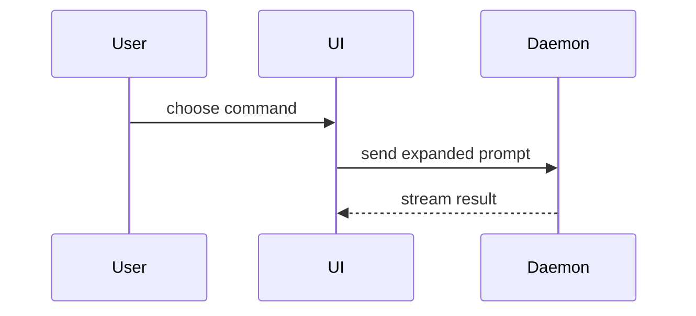

- Help the user understand the current topic of conversation visually. Skip the preamble and keep prose brief. Pick the smallest view that makes the key point clear
- Explain like I'm someone who knows nothing about this topic, using a HTML artifact with big pictures and few words
- Show the core mental model
- If

### Kinds of blocks or examples

- Show logic or an algorithm as pseudocode:

```text
on(save)
  if content is unchanged
    return cached result
  write new content
  return fresh result
```

- Show runtime control flow as a call tree:

```text
submitForm
  createSession
    persistPrompt
    launchAgent
  navigateToSession
```

- Show UI structure as a component tree, including state and module boundaries that matter:

```tsx
<SessionPage> (apps/example/src/routes/session.tsx)
  useSessionEvents()
  <SessionToolbar>
    <RunSkillButton> (packages/ui)
```

- Show file responsibility or a broad refactor as a shallow file tree:

```text
src/
├── commands/       # parses user actions
├── sessions/       # owns session state
└── transport/      # sends API requests
```

- Show component interaction, control flow, or data flow with Mermaid:



- Use `diff` when the point is what changes and the surrounding shape already exists. Match the diff shape to the topic.

For a component change:

```diff
 <SessionPage>
   useSessionEvents()
   <SessionToolbar>
+    <RunSkillButton />
   <SessionTimeline>
+    <SkillResultCard />
```

For a file-layout change:

```diff
 src/
 ├── commands/
+│   └── show-me.ts       # expands the slash command
 ├── sessions/
-└── transport.ts
+└── transport/
+    ├── client.ts
+    └── stream.ts
```

For a call-tree or call-stack change:

```diff
 submitForm
   createSession
     persistPrompt
+    expandSkillMention
     launchAgent
-  navigateToSession
+  navigateToSession
+    subscribeToEvents
```

For a state or control-flow change:

```diff
 on(save)
-  write content
+  if content is unchanged
+    return cached result
+  write new content
+  invalidate cache
```

- Show the whole block when most of it is new, when omitted context would hide ownership or order, or when the user needs a copyable target shape:

```ts
function expandSkill(command: string): string {
  const skillName = command.slice(1)
  return `use the ${skillName} skill`
}
```

- For a visual UI, layout, state comparison, or concept too dense for Mermaid, write one focused HTML file — a diagram, an infographic, or a short slide deck, whichever fits the point. Match the product's colors, type, spacing, and components; use real labels and data; support desktop and mobile. Then open it for the user:

```
Bash(open path/to/show-me-{description}.html)
```

## Build one HTML file

Create `eli5-<topic>.html` in the current workspace unless the user gives a path. Use a safe, short, lowercase topic name.

The file must contain all HTML, CSS, JavaScript, SVG, and other image data. Do not create companion files. Do not load a CDN, web font, framework, Mermaid, analytics, or any remote asset. Source links may point to the web, but the presentation must work without them.

The presentation must include:
- System fonts, readable line lengths, and body-text contrast of at least 4.5:1.
- Visible keyboard focus, semantic headings, real buttons, and useful accessible names.
- No autoplay. Honor `prefers-reduced-motion` and keep the content usable without animation.

## Serve it locally

Serve the containing directory over HTTP instead of opening the file through `file://`. Reuse an existing local server when the project has one. Otherwise, start a loopback-only static server on an available port:

```sh
python3 -m http.server 8000 --bind 127.0.0.1 --directory "/absolute/path/to/output-directory"
```

Run the server in a way that does not block the remaining work. Record its process ID or use the harness process controls so it can be stopped later. Do not expose the server to the local network. Do not deploy the artifact unless the user asks.

Open the exact page URL, for example `http://127.0.0.1:8000/topic-eli5.html`.

## Return to the user

Do not paste the HTML into the response. Give the user:

- The artifact path.
- The local URL.
- One sentence about the journey the presentation teaches.
- The two or three deeper paths offered on the final step.

Keep the response short. The presentation is the explanation.
